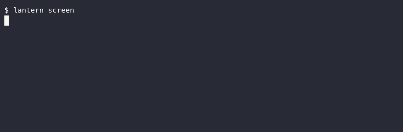

# lantern

An on-device accessibility agent for macOS. Describes what's on your screen or in front of your camera, out loud -- entirely offline.



Runs on Apple's Vision framework plus the on-device Foundation Model via [langchain-apple-foundation-models](https://github.com/rajanshxrma/langchain-apple-foundation-models) -- no API key, no network call, nothing leaves the machine.

## Install

```
pip install -e .
lantern screen    # describes the current screen, out loud
lantern camera    # describes what the camera sees, out loud
```

Or run it as a menu bar app:

```
lantern-menubar
```

First run of `lantern screen`/`lantern camera` triggers macOS's one-time permission prompts (Screen Recording, Camera) -- grant them once, they stick. `lantern camera` briefly lights up the camera indicator for each capture, same as any app taking a photo.

Requires macOS 26+, Apple Silicon.

## How it works

Two backends, chosen automatically -- never configured by hand:

| | Native | Vision (what you actually get today) |
|---|---|---|
| **Requires** | macOS 27 beta + a compiled Swift helper (`native/`) built against the beta SDK -- see below | Nothing beyond stable macOS 26+ |
| **How it sees** | `FoundationModels.Attachment<ImageAttachmentContent>` -- the model reasons over the actual image directly, verified against the real beta SDK's `.swiftinterface` (not the WWDC26 preview description) | `VNRecognizeTextRequest` (OCR) + `VNClassifyImageRequest` (scene/object labels) extract structured data; the on-device model narrates *only* from that -- it never sees pixels |
| **Status** | Implemented and real -- but its runtime availability depends on the exact machine (see the version-skew finding below); when unavailable, falls back automatically | Fully working, tested, benchmarked below. What every clone of this repo actually gets. |

`get_backend()` probes for native at runtime with a real subprocess smoke-test (not a version check or file-existence check) and falls back automatically -- this repo runs and demos correctly on stable macOS whether or not native is actually usable on the machine running it, and picking up native support later is a change to one backend, not a rewrite.

**Building the native helper** (optional -- only does anything useful with Xcode-beta installed):

```
cd native && ./build.sh
```

FoundationModels' image-input surface is pure Swift (generics, protocols) -- verified directly that PyObjC cannot bridge it at all (`import FoundationModels` fails under PyObjC even with the beta installed). So the native path is a small standalone compiled Swift executable (`native/`), invoked via subprocess, the same pattern this repo already uses for `/usr/sbin/screencapture` in `capture.py` -- not a PyObjC call.

## Three real findings during testing (all fixed or honestly documented)

**A real Xcode-beta/OS-beta version skew (native backend, not a bug in this code).** The native Swift helper compiles cleanly against Xcode-beta's SDK (which declares `Attachment.init(imageURL:orientation:)`), but on this machine it crashes at *runtime* with a dyld `Symbol not found` error -- the installed OS beta build (`26A5378j`) doesn't precisely match the Xcode-beta build (`27A5209h`) it was compiled against, so the OS's actual `/System/Library/Frameworks/FoundationModels.framework` doesn't yet export a symbol its own paired SDK headers declare. This is exactly the risk the dual-pipeline architecture (native primary, Vision-OCR automatic fallback) was built to absorb -- `_probe_native()` does a real subprocess smoke-test (not a file-existence or version check) so this is detected and falls back cleanly, with zero code changes needed once a matching OS update closes the gap. Confirmed the fallback works correctly: `active_backend_name()` honestly reports `"vision"` on this machine right now.

**Narration hallucination.** Early testing found the narration step inventing plausible-sounding but entirely fictional detail: given an image containing only the word "CALENDAR" on a blank background, the model's first-draft narration was *"a calendar with multiple months visible, with dates present on each month page"* -- a fully invented scene. Vision's own extraction was correct (just the text "CALENDAR", no scene labels); the hallucination was purely in the narration prompt letting the model fill in a plausible-sounding scene from one evocative word. This matters more here than in a general chatbot: someone using this *can't see the image themselves* to catch the error. Fixed by rewriting the narration instructions to explicitly forbid adding anything not in Vision's actual extracted output. Re-verified: the same input now correctly narrates only *"CALENDAR is visible in the image."* See `backends.py`'s `_NARRATION_INSTRUCTIONS` for the real prompt.

**Captured frames outliving their purpose.** `capture_screen()`/`capture_camera()` write the captured frame to a temp file and return its path -- but neither `cli.py` nor `menubar.py` originally deleted that file after describing it, meaning every real run of `lantern camera` left an actual photo of the user sitting in `/tmp` indefinitely. For a tool whose entire premise is "nothing leaves the machine," leaving captured images lying around on the machine indefinitely is its own kind of privacy failure. Fixed: both entrypoints now delete the captured file in a `finally` block immediately after describing it, so a capture never outlives its own description -- see `cli.py`/`menubar.py`.

## Benchmarks (measured, this machine, vision backend -- native isn't usable on this machine right now, see the version-skew finding above)

| Case | Latency | Recognized correctly |
|---|---|---|
| Single word | 8.06s | Yes |
| Short phrase | 7.55s | Yes |
| Longer line | 4.18s | Yes |
| Blank image | 0.06s | N/A (correctly reports nothing recognizable) |

Median 7.55s, range 4.18-8.06s for non-blank images. Reproduce with `python3 scripts/eval_lantern.py`.

## Limitations

- Native backend's real-world availability depends on the exact beta build pairing on your machine -- see the version-skew finding above. Not a limitation of the code; a limitation of running on pre-release software.
- Vision's OCR/classification is deliberately narrow (text + scene labels) rather than open-ended visual understanding -- it can't answer "what's weird about this photo," only describe what it detected.
- ~7-8s latency per description is real and measured, not hidden -- fine for "describe this" on demand, not yet fast enough for continuous narration.

## License

MIT
